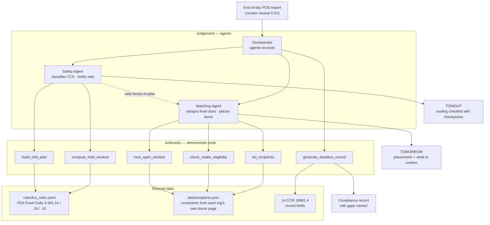

# Kitchen Surplus Agent

Turns a restaurant's end-of-day POS export into a donation-ready, compliance-ready
surplus handoff — in the fifteen minutes after close, before anyone has to think
about it.

Built with the [Strands Agents SDK](https://strandsagents.com/) for the AWS
*Agents for Humans* hackathon.

---

## The problem

Restaurants do not skip food donation because they don't care. They skip it
because donating costs about twenty minutes of unpaid, after-close judgement
work. The industry research is consistent about what that work is:

> Restaurants must pay staff to manage the donation process, which includes
> sorting salvageable food, accurately weighing and logging inventory, and
> coordinating third-party pickups, with this labor often occurring outside of
> peak operating hours, requiring overtime pay.
> — [Divert, *Obstacles to Donating Surplus Food*](https://divertinc.com/obstacles-to-donating-surplus-food-across-the-food-supply-chain/)

In California that work is no longer optional. Under **SB 1383**, Tier 2
commercial edible food generators — restaurants with 250+ seats or 5,000+ sq ft,
plus hotels, caterers and food service providers — must arrange edible food
recovery and keep records of it
([14 CCR 18991.4](https://www.law.cornell.edu/regulations/california/14-CCR-18991.4)).

### What the real data says about why it fails

Point the tool at a Saturday close and the constraints collide:

```
Restaurant closes                        21:30 Sat
Hot-held food's safe window ends        ~01:30 Sun   (FDA Food Code 3-501.19)

Food Runners SF        hours not published on their donor page
White Pony Express     opens 08:00 Sun   — 10.5 h away, and needs 300 lb for pickup
SF-Marin Food Bank     opens 08:00 Mon   — and refuses restaurant food outright
Alameda County CFB     opens 07:00 Mon   — 33.5 h away
```

At the moment the surplus appears, **nothing is open**, and the hot-food clock
expires long before anything is. That is the mechanism by which this food gets
thrown away — and it means the decisive action is not matching. It is deciding,
tonight, which pans go into rapid cooling, converting a four-hour hot clock into
a next-morning cold donation.

## What this is not

[Careit](https://careit.com/) and [Copia](https://www.gocopia.com/) already solve
what happens *after* a surplus post exists: matching, pickup logistics and
donation logs. Careit is free and generates the SB 1383 written agreement.

This project sits **upstream of them**. It produces the post — with weights,
safety windows, labels and the compliance record already worked out — and hands
it off. It is a feeder for the food recovery network, not a competitor to it.

---

## Architecture



### The one design rule

> **Judgement goes to an agent. Arithmetic goes to a tool.**

Whether *"Kung Pao Chicken"* is a TCS food is a judgement about a free-text menu
name — an agent decides that. How long it then stays safe is arithmetic against a
published rule — a tool decides that, and the agent is instructed never to state
a deadline it did not get back from one:

> *"Never state a deadline you did not get back from that tool. If you find
> yourself calculating hours in your head, stop and call the tool."*

Every threshold in `rules/tcs_rules.yaml` carries its source. The model
classifies; it does not invent limits.

---

## What a run produces

```
TONIGHT — 21:30 to 21:45
  Discard Yangzhou Fried Rice, 14.0 lb — window closed 20:30, an hour before
    close. Cooling cannot restart an expired clock.  (FDA 3-501.19)
  Rapid-cool six pans. Mac & Cheese first: already at 96 F since 20:00.
  Two alarms: <=70 F by 23:30, <=41 F by 03:30. Miss either -> reheat to
    165 F and restart, or discard.  (FDA 3-501.14)
  Mac & Cheese is capped at 00:00 — 1.5 h of its danger-zone budget is spent.

TOMORROW — Sunday
  Food Runners SF, all 97.65 lb, one call.
  Confirm (unpublished): Sunday pickup, window, city limits, shellfish policy.
  Fallback White Pony Express — pickup ruled out, 97.65 lb is under their
    published 300 lb minimum; drop-off 08:00-16:00 instead.
  All placements gated on the 03:30 cooling actually completing.
```

SF-Marin Food Bank never appears as a placement: their donor page refuses
restaurant food, and the eligibility tool blocks it with that citation.

---

## Two bugs the build found

Both were found by running the thing, and both are the reason the
judgement/arithmetic split earns its keep.

**1. The agent could look recipients up but not list them.** It had
`check_intake_eligibility` and `next_open_window`, both keyed by
`recipient_id` — and no way to discover which identifiers existed. It guessed
seventeen formats, matched nothing, and reported honestly that it had placed
nothing rather than inventing organizations. The guardrail held; the tool
surface was the bug. Fixed by adding `list_recipients`.

**2. The cooling tool granted time the law does not allow.** The two-stage
schedule in FDA 3-501.14 assumes food leaving the stove above 135 F. Applied
unchanged to a pan already sitting at 96 F, it granted six hours — but that item
had already spent 1.5 of its 4 danger-zone hours, and cooling does not reset a
running clock. The model noticed and reasoned around it. That is exactly the
wrong place for the fix: the next run might simply trust the tool. The rule now
lives in the tool, with a test.

---

## Running it

```bash
python3 -m venv .venv && ./.venv/bin/pip install -r requirements.txt
cp .env.example .env          # then add a key
./.venv/bin/python -m kitchen_surplus.cli
./.venv/bin/streamlit run app.py
```

The model provider is behind a factory (`src/kitchen_surplus/llm.py`) — Amazon
Bedrock, the Anthropic API, or a local Ollama model, chosen by `KSA_PROVIDER`.
The Bedrock path deliberately refuses to fall back to the `default` AWS profile
and requires `AWS_PROFILE_KSA` to be named explicitly.

## Testing

```bash
./.venv/bin/python -m pytest tests -q            # 20 unit tests, no model
KSA_LIVE=1 ./.venv/bin/python -m pytest tests/test_pipeline_live.py -v
```

The live suite asserts **behaviour, not wording** — a model swap is expected to
change the prose and must not change any of the conclusions: that the expired
item is discarded, that the 300 lb pickup minimum blocks a placement, that
unpublished constraints surface as questions rather than assumptions.

## Data

All POS data is synthetic and vendor-neutral (`scripts/gen_pos_data.py`); no
merchant data is used. Recipient constraints in `data/recipients.json` are
transcribed from each organization's own public donor page, with `source_url`
recorded. **A constraint an organization does not publish is stored as `null`**,
and the agent is required to treat that as something to ask about rather than
assume — which is why a run ends with a short list of questions for the
recipient, not a fabricated certainty.

## Limitations

- Recipient constraints are a snapshot taken 2026-09-05 and are not re-fetched.
- Routing is not solved; drop-off versus pickup is decided, distance is not.
- Nothing is dispatched. The agent produces the handoff; a human sends it.
- Coverage is four Bay Area organizations, enough to exercise the constraint
  types, not enough to serve a real kitchen.

## License

MIT
